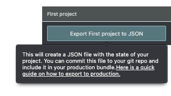

# Getting Started

This walk-through of Theatre.js' basics will show you how to get started in a couple of minutes. If you don't want to follow along, you can also just copy the code in the [wrapping up](#wrapping-up) section.

## Prerequisites

Theatre comes as npm packages, so we need a module [bundler](https://github.com/topics/module-bundler) like [webpack](https://webpack.js.org) or [esbuild](https://esbuild.github.io). [CodeSandbox](https://codesandbox.io) would also work when [configured](#note-on-codesandbox).

## Installation

Theatre comes in two packages:
* [`@theatre/core`](https://npmjs.com/package/@theatre/core), the core animation library
* [`@theatre/studio`](https://npmjs.com/package/@theatre/studio), the visual editor.

<code-group>
<code-block title="npm">
```bash
$ npm install --save @theatre/core
$ npm install --save @theatre/studio
```
</code-block>

<code-block title="yarn">
```bash
$ yarn add @theatre/core
$ yarn add @theatre/studio
```
</code-block>

</code-group>

## Setting up a scene

In this section you will set up a simple scene on a webpage and animate a div. If you don't already have a project, you can get started with a blank page and 1 line of JavaScript:

```ts
document.body.innerHTML = `
  <div id="box"
       style="position: absolute; width: 100px; height: 100px; background: green;" />
`
```

### Importing Theatre

```ts
import {getProject} from "@theatre/core"
import studio from "@theatre/studio"

// initialize the studio so the editing tools will show up on the screen
studio.initialize()
```

### Creating a Project

A Theatre project is like a save file that holds all the animations that you design in `@theatre/studio`. It is ultimately consumed by `@theatre/core` to run those animations.

* Projects are a way to organize related work. Everything in Theatre.js is part of a project.
* You can create multiple projects in a single web page, but often one project is sufficient for a whole website.

```ts
const proj = getProject("First project")
```

### Creating a Sheet

A sheet is a self-contained unit of animation.

A [project](#projects) can have multiple sheets. Each sheet could have multiple instances running at the same time.

```ts
const sheet = proj.sheet("First scene")
```


### Creating an Object

Objects in theatre are named entities that you can subscribe to.

```ts
const obj = sheet.object(
  // The object's key is "Fist object"
  "First object",
  // These are the object's default values
  {
    foo: 0,
    bar: true,
    baz: "A string",
  }
)
```

By now we should be able to see our project and sheet and object show up in the outline.

<VideoWithDescription src="/getting-started/scene-and-object.mp4">An outline of the graph appears once the pointer moves to the left side of the page. The outline says "First Project / Scene: default / First object". The user selects "First object", after which the Details Editor panel shows up on the left. The Details Editor panel shows the three props, one a number, the other a checkbox, and the other a text input box. The user then changes these values by clicking/dragging, or entering a value via keyboard.</VideoWithDescription>

### Listening to changes in values

There are a few ways to listen to changes in values. The simplest method is through `object.onValuesChange()`.

```ts
// Calls the callback every time the values change and returns a function to unsubscribe
const unsubscribe = obj.onValuesChange(function callback(newValue) {
  console.log(newValue.foo) // prints a number
  console.log(newValue.bar) // prints a boolean
  console.log(newValue.baz) // prints a string
})
```

<VideoWithDescription src="/getting-started/onvalueschange.mp4">Continuing from the last video, the console of the devtools in the browser is open. The user changes the values in the Details Editor panel. The value of the numeric prop keeps being logged to the console as the user changes it.</VideoWithDescription>

### Hooking up our object to HTML

The `object.onValuesChange()` method allows us to connect our `Object`s to visual elements, like HTML elements, WebGL, or even IOT devices.

```ts
// assuming we have an absolutely positioned html element with "box" as its ID
const div = document.getElementById("box")
obj.onValuesChange((newValue) => {
  // obj.foo will now set the horizontal position of the div
  div.style.left = newValue.foo + "px"
})
```

## Animating

This section will show you how to use Theatre.js' UI to animate the objects you set up in the previous section.

### Sequencing properties

So far, you've set the values of each prop statically. In order to animate them, we need to put them on a sequence.

Right-click on the label of the prop `"foo"`, and choose "Sequence". Keyframes are automatically created/updated for sequenced properties whenever you change their value. Alternatively, keyframes can also be created manually by pressing the diamond-shaped keyframe button.

<VideoWithDescription src="/getting-started/animating-1.mp4">Continuing from the last video, the console of the devtools in the browser is open. The user right-clicks on the numeric prop called "foo", and from the open menu, chooses "Sequence". A sequence editing panel shows up with no keyframes. The user proceeds to create keyframes and scrub through the sequence. As the user change values and play with the keyframes, the value of the prop is getting logged to the console in real time.</VideoWithDescription>

### Playing back the sequence

Theatre.js exposes various ways to control playback of your animations.

```ts
// Play normally
sheet.sequence.play();

// Play at 4x speed
sheet.sequence.play({ rate: 4 });

// Plat between the 0 and 2 second marks
sheet.sequence.play({ range: [0, 2] });

// Play 4 times
sheet.sequence.play({ iterationCount: 4 });

// For finer control, you can also manually move the playhead to any position you want
sheet.sequence.position = 4;
```

## Exporting and bundling

In this section you will export your animation and make your code ready for production.

### Bundling Theatre.js state

At development time, Theatre.js saves the animation data you create to Local Storage. For production, however, you need to export this data and bundle it with your application. 

To export the state of your project, pick your project from the Outline panel and click on the Export button in the Inspector panel.



Then use the exported state in your code.

```ts
// Import the state.json file you just exported
import state from './state.json'

// Initialize your project with the state you just imported
const proj = getProject("First project", { state });
```

### Removing Studio from the production build

In production, you may not want to bundle the studio UI. In this case, you can just comment out `studio.initialize()` (and any other references to `studio`) manually, and it'll be tree-shaken out of your bundle. In case your bundler supports compile-time environment variables, you can to do something like this to automate the process:

```ts
if (process.env.NODE_ENV === 'development') {
    studio.initialize()
}
```

::: tip
While most users would want to remove Studio from their final bundle, you don't have to! If you have a creatively inclined audience that'd appreciate playing with the underlying state of your product, feel free to leave it in.

You can hide the Studio UI by calling `studio.ui.hide()`. Users can toggle it by pressing `Opt` + `\` (Mac) or `Alt` + `\` (Win).
:::

## Wrapping up

By the end of this walk-through, you should have something like this:

```ts
import {getProject} from "@theatre/core"
import studio from "@theatre/studio"
import state from './state.json'

// initialize the studio so the editing tools will show up on the screen
studio.initialize()

const body = document.body;

body.innerHTML = `
  <div id="box" style="position: absolute; width: 300px; height: 300px; background: green;" />
`

const proj = getProject("First project", { state });
const sheet = proj.sheet("First scene");
const obj = sheet.object(
    // The object's key is "Fist object"
    "First object",
    // These are the object's default values
    {
        foo: 0,
        bar: true,
        baz: "A string",
    }
);

// Calls the callback every time the values change
obj.onValuesChange(function callback(newValue) {
    console.log(newValue.foo) // prints a number
    console.log(newValue.bar) // prints a boolean
    console.log(newValue.baz) // prints a string
})

const div = document.getElementById("box")!
obj.onValuesChange((newValue) => {
    // obj.foo will now set the horizontal position of the div
    div.style.left = newValue.foo + "px"
})
```

For a more in-depth guide on Theatre.js' concepts, check out the [Concepts](concepts.md) chapter. For a deep dive into how you can use Theatre.js to create detailed animations, we walk you through the whole process from start to finish in [this video tutorial](https://www.youtube.com/watch?v=icR9EIS1q34).